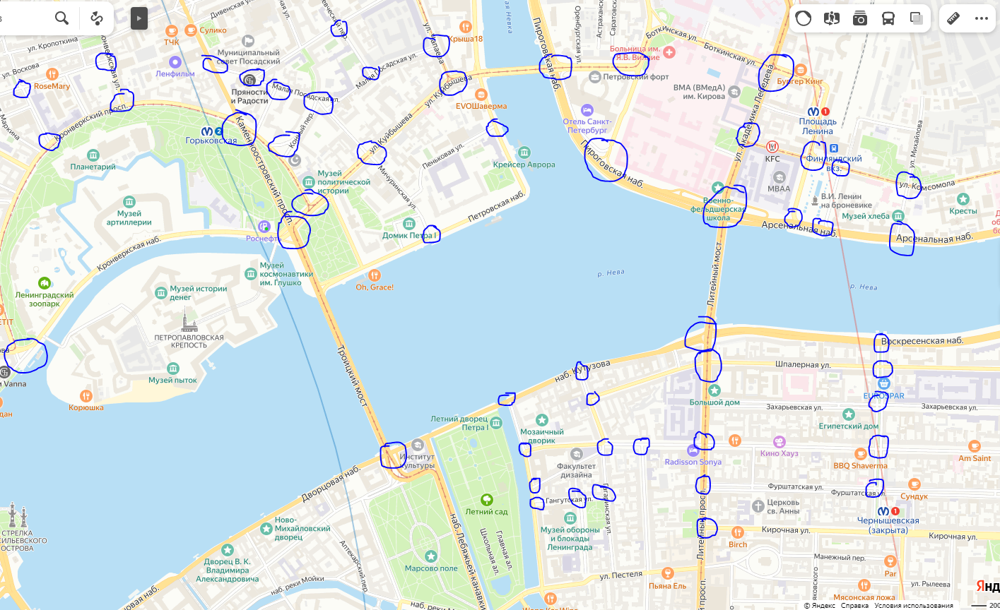

## Реквизиты
Жолобов Даниил Валерьевич
4 курс
z34434
2024

# ЛР #3: Алгоритм работы с графами (моделирование транспортной системы)

## Цель

Познакомить студента с инструментами, направленными на решение задач, использующих графовые модели.

## Задача

Моделирование сложных транспортных процессов города, выявление узких участков, а также формирование предложений по оптимизации.

Дано: На изображении отображены перекрестки, которые рассматривать для решения задачи.

В качестве агентов (автомобилей) и маршрутов их перемещения использовать придуманные данные, отраженные в отчете по лабораторной работе (предусмотреть часы пик утром и вечером).

1. Задача 1: Необходимо определить TOP-10 самых загруженных участков между перекрестками, а также время на «рассасывание» этого затора.

Отображать такие параметры, как:
- количество агентов (автомобилей) на участке;
- процент загруженности участка;
- длительность высокой загруженности (более 90%).

2. Задача 2: С помощью сформированной модели предложить варианты решения заторов.

3. Для задач 1 и 2 рассчитать и обосновать оценку вычислительной и ёмкостной сложности.

## Решение

Моделирование сложных транспортных процессов города, выявление узких участков, а также формирование предложений по оптимизации.

Дано: На изображении отображены перекрестки, которые рассматривать для решения задачи.

В качестве агентов (автомобилей) и маршрутов их перемещения использовать придуманные данные, отраженные в отчете по лабораторной работе (предусмотреть часы пик утром и вечером).

1. Задача 1: Необходимо определить TOP-10 самых загруженных участков между перекрестками, а также время на «рассасывание» этого затора.

Отображать такие параметры, как:
- количество агентов (автомобилей) на участке;
- процент загруженности участка;
- длительность высокой загруженности (более 90%).

2. Задача 2: С помощью сформированной модели предложить варианты решения заторов.

3. Для задач 1 и 2 рассчитать и обосновать оценку вычислительной и ёмкостной сложности.

## Заключение
